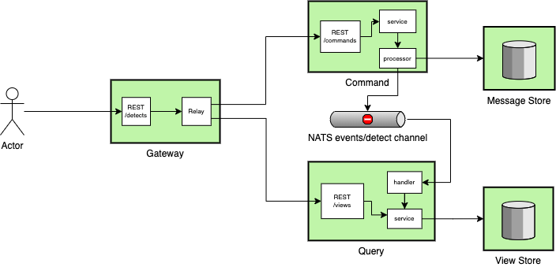

# Web Server Detector

[](https://github.com/diptanw/server-detector/actions)

- [Overview](#overview)
- [Architecture](#architecture)
- [API Specification](#api-specification)
- [Development](#development)
- [Setup and Testing](#setup-and-testing)

## Overview

The solution intended to demonstrate knowledge in principles of web development using Go's stdlib. It is developed for educational and training purposes as part of the another home project.
Many parts of the application will be replaced in the production service by more advanced and powerful open-source solutions like:

- [Echo](https://github.com/labstack/echo) High performance, minimalist Go web framework
- [Gorilla Mux](https://github.com/gorilla/mux) A powerful HTTP router and URL matcher
- [Konfig](https://github.com/moorara/konfig) A Minimal Library For Reading Configurations
- [Zap](https://github.com/uber-go/zap) Fast, structured, leveled logging

All components are designed to be somewhat testable, but will more likely be lacking code coverage by now.

## Architecture

The architecture of this application is based on the simplified CQRS pattern, where the **Command** is the request handled by [commander](cmd/commander) and the **Query** is a materialized view returned from [querier](cmd/querier). As a result, the system is asynchronous and eventually consistent, which allows for long-running detection operations in the background and increases resiliency to connection losses.

These services operate individually and are isolated from each other, implementing an event-driven publisher/subscriber model, but are accessible via common RESTful API exposed by [gateway](cmd/gateway). Database is also replaced by its [in-memory](/internal/platform/storage) implementation in all services to reduce coding efforts and infrastructure setup.

Load balancing can also be accomplished by horizontal scaling and replicating services based on the requested resources, typically handled by the API gateway/reverse proxy and service discovery. Throttling, by introducing a message queue buffer, will help smooth out peaks when the system automatically scales or overloaded.
A typical architecture would also include Event Sourcing, snapshoting and state materialization.



## API Specification

For complete API documentation see the [OpenAPI Spec](api/openapi.yml) document.
You can view this document at [Swagger Editor](https://editor.swagger.io).

The API compliant with:

- [RESTfull API Principles](https://restfulapi.net/)
- [JSON API Specification](https://jsonapi.org/format/)

## Development

This project follows design and development principles described in:

- [Go Code Review Comments](https://github.com/golang/go/wiki/CodeReviewComments)
- [Uber Go Style Guide](https://github.com/uber-go/guide/blob/master/style.md)
- [Effective Go](https://golang.org/doc/effective_go.html)
- [Standard Go Project Layout](https://github.com/golang-standards/project-layout)
- [Package Oriented Design](https://www.ardanlabs.com/blog/2017/02/package-oriented-design.html)

## Setup and Testing

To test the application you need docker installed. Use docker-compose to set thing up.

```sh
docker-compose up --build
```

Go to <http://localhost:6081> in the browser and use swagger-ui to make requests in the UI. Or:

POST request to <http://localhost:6080> with the "application/json" body:

```sh
curl -sD - -X POST "http://localhost:6080/v1/detects" \
    -H "Content-Type: application/json" \
    -d '{"data":["google.se", "yahoo.com"]}'
```

GET request to the returned link in "Location" header

```sh
curl -sb -H "Accept: application/json" "http://localhost:6080/v1/detects/72a0216846d39a3cecb4"
```

Expected output:

```json
{
   "data":{
      "id":"b62eee87a02266de814b",
      "requestId":"a4973fec74f2f85e96b3",
      "hosts":[
         {
            "domain":"google.se",
            "server":"gws",
            "ips":[
               "172.217.21.131",
               "2a00:1450:400f:80d::2003"
            ]
         },
         {
            "domain":"yahoo.com",
            "server":"ATS",
            "ips":[
               "72.30.35.10",
               "98.137.246.7",
               "98.138.219.232",
               "72.30.35.9",
               "98.138.219.231",
               "98.137.246.8",
               "2001:4998:c:1023::4",
               "2001:4998:58:1836::10",
               "2001:4998:44:41d::3",
               "2001:4998:c:1023::5",
               "2001:4998:44:41d::4",
               "2001:4998:58:1836::11"
            ]
         }
      ],
      "createdAt":"2020-05-07T10:37:59.0193623Z",
      "updatedAt":"2020-05-07T10:37:59.6141554Z"
   },
   "links":{
      "self":{
         "href":"v1/views/a4973fec74f2f85e96b3"
      }
   }
}
```
